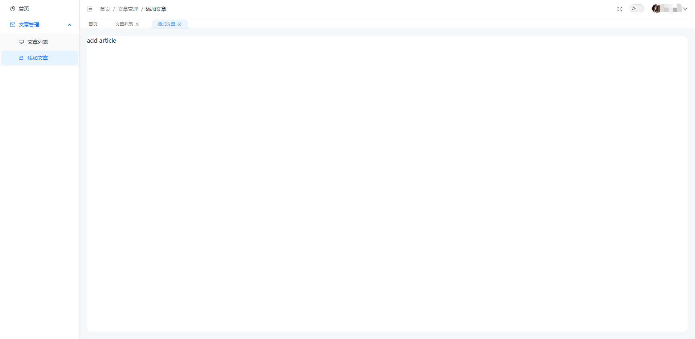
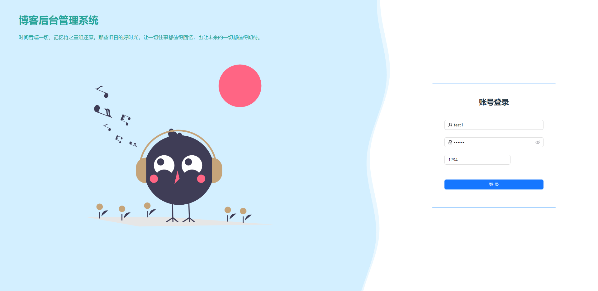

# blog-admin-next

后台管理系统：简易模板，主要功能有网站主题切换、侧边菜单栏收缩、网站全屏、面包屑、已访问页面tagViews组件、登录/退出登录。  
技术栈：Vue3 + Vite4 + TypeScript + ant-design-vue4 + Vue Router4 + Pinia2 + Axios + Sass + ESLint + Prettier + Vitest。

## Example



## Project Setup

```sh
pnpm install
```

### Compile and Hot-Reload for Development

```sh
pnpm dev
```

### Type-Check, Compile and Minify for Production

```sh
pnpm build
```
